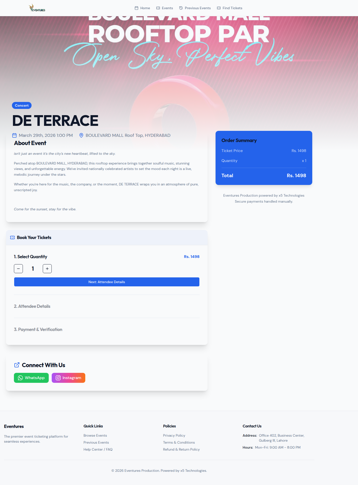
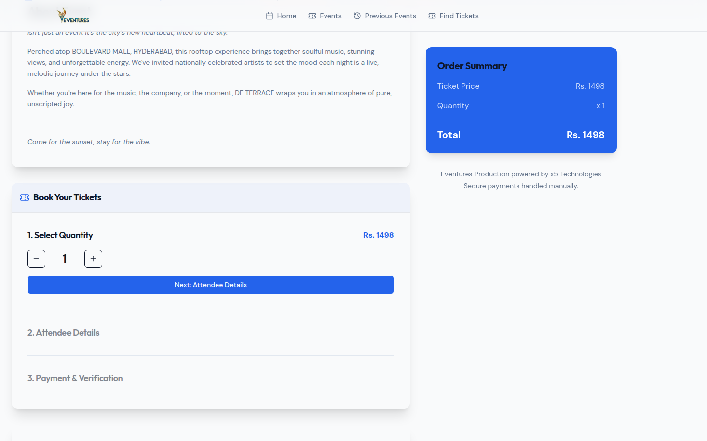
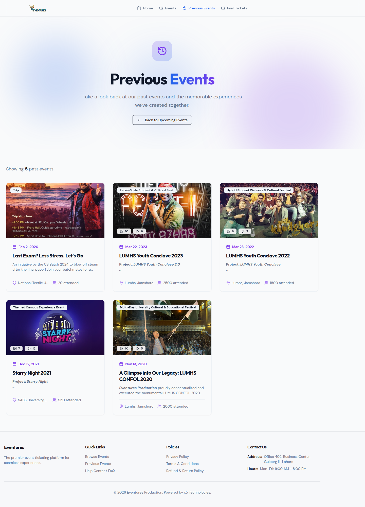

# Eventures Production - Event Ticketing & Management Platform

> A full-featured, production-grade event ticketing and management platform built entirely from scratch in Pakistan. Designed for seamless event discovery, ticket booking, entry management, and organizer tools — serving concerts, conferences, seminars, cultural fests, and more.

**Status:** Live in Production at [eventuresproduction.pk](https://eventuresproduction.pk/)
**Type:** Custom-built SaaS Platform (Closed Source)
**Parent Company:** [X5 Technologies](https://x5technologies.site)
**Origin:** Made in Pakistan 🇵🇰

---

## 🇵🇰 Proudly Made in Pakistan — Powered by X5 Technologies

> **Eventures Production** is a child company of **[X5 Technologies](https://x5technologies.site)** — a Pakistani tech company building production-grade software solutions entirely from the ground up in Pakistan.

This platform was **designed, developed, and deployed entirely in Pakistan** — from the architecture and codebase to the payment integrations and infrastructure. It is a testament to what Pakistani developers are building for Pakistani audiences and beyond.

---

## 💳 Payment Options

Eventures Production supports **two payment methods** — an automated online gateway and a manual bank transfer option — ensuring every customer can complete their purchase regardless of how they prefer to pay.

---

### Online Payment — PayFast (Pakistani Payment Gateway)

Eventures Production is integrated with **PayFast by apps.net.pk**, a leading Pakistani payment gateway, enabling seamless and secure ticket purchases in PKR.

**How it works:**
1. Customer selects tickets and proceeds to checkout
2. System generates a secure payment request with order details
3. Customer is redirected to PayFast's hosted checkout page
4. Payment is verified server-side using **SHA-256 cryptographic hash validation** (`basket_id|SECURED_KEY|MERCHANT_ID|err_code`) to prevent any manipulation
5. IPN (Instant Payment Notification) provides backup verification
6. Order is auto-confirmed, tickets are generated and delivered via email instantly

**Key properties:**
- Supports credit/debit card payments processed in **PKR (Pakistani Rupee)**
- Anti-fraud server-side hash verification
- Sandbox (testing) and production mode support
- Fully automated — no manual order approval needed after payment

---

### Manual Payment — Bank Transfer / EasyPaisa / JazzCash

For customers who prefer to pay via bank transfer, EasyPaisa, or JazzCash, Eventures offers a **Manual Payment** option at checkout.

**How it works:**
1. Customer selects "Manual Payment" at checkout
2. System displays the organizer's bank account / mobile wallet details
3. Customer transfers the payment and submits their transaction reference
4. Admin reviews and verifies the payment
5. Once confirmed, the order is manually approved and tickets are generated and delivered via email

**Key properties:**
- Supports all major Pakistani bank transfers (HBL, UBL, Meezan, etc.)
- Supports mobile wallets — EasyPaisa and JazzCash
- Admin is notified of pending manual payments for quick review
- Prevents ticket issuance until payment is verified — zero fraud risk
- Ideal for customers without access to debit/credit cards

---

## Overview

Eventures Production is a comprehensive event ticketing platform purpose-built for Pakistani event organizers and attendees. It features a public-facing event discovery website, a ticket booking flow with secure payment processing, a QR-code-based entry management system, and a full admin panel — all developed as a single, unified platform.

Unlike off-the-shelf solutions, Eventures was designed and coded from the ground up to meet the specific needs of event organizers in Pakistan, with a focus on real-world events (concerts, university fests, cultural events, corporate seminars), secure Pakistani payment gateway integration, and instant digital ticket delivery.

---

## Key Features

### Public Website
- Hero section with animated call-to-action and event highlights
- Upcoming events showcase with event type, date, venue, capacity, and pricing
- Previous events gallery with photo archives
- Event category filtering (Concert, Conference, Trip, Cultural Fest, and more)
- Ticket search by order reference or email
- SEO-optimized with Open Graph meta tags
- Fully responsive design (mobile, tablet, desktop)
- Powered by X5 Technologies branding

### Event Discovery & Booking
- **Event Listings** — Browse all upcoming and past events with rich detail cards
- **Event Detail Pages** — Full event info: description, date, time, venue, capacity, ticket tiers, and cover images
- **Ticket Booking Flow** — Select ticket quantity, enter attendee info, apply promo codes, and checkout
- **PayFast Secure Checkout** — Integrated Pakistani payment gateway with SHA-256 verification
- **Manual Payment Option** — Bank transfer, EasyPaisa, or JazzCash with admin verification workflow
- **Instant Ticket Delivery** — Digital tickets delivered immediately via email after payment confirmation
- **Ticket Search** — Find existing tickets by order ID or email address

### Attendee Experience
- **Digital Tickets** — QR-code-based tickets for frictionless venue entry
- **Order Confirmation** — Instant email with ticket details and QR codes
- **Ticket Management** — View and re-download tickets from order lookup page
- **Event Gallery** — Browse photo albums from previous events

### Admin Panel
- **Dashboard** — Revenue overview, ticket sales stats, event counts, recent orders
- **Event Management** — Full CRUD for events with cover image upload, ticket tiers, capacity limits, date/time/venue configuration
- **Order Management** — View all orders, payment status, attendee details, and manual order actions
- **Ticket Verification** — QR code scanning interface for on-site entry management
- **Previous Events / Gallery** — Manage photo galleries for past events
- **Promo Code Management** — Create discount codes with percentage/fixed value, usage limits, and expiry
- **Attendee Management** — View attendee lists per event with check-in status
- **Settings** — SMTP email configuration, PayFast credentials, platform settings

---

## Technical Architecture

### Frontend
- **React 18** with TypeScript
- **Tailwind CSS** for responsive, utility-first styling
- **Shadcn/UI** component library
- **TanStack Query** for server state management and caching
- **Wouter** for client-side routing
- **Lucide React** icon library
- Fully responsive design (mobile, tablet, desktop)

### Backend
- **Node.js + Express** — RESTful API design with consistent JSON responses
- Session-based authentication
- CORS and security middleware
- **Zod** for request/response validation
- Structured logging with **Pino**

### Database
- **PostgreSQL** with **Drizzle ORM** for type-safe database operations
- UUID primary keys for all entities
- JSONB columns for flexible ticket/attendee data

### Payment Integration
- **PayFast (apps.net.pk)** — Pakistani payment gateway (online)
- **Manual Payment** — Bank transfer, EasyPaisa, JazzCash with admin approval workflow
- SHA-256 cryptographic hash verification for all PayFast callbacks
- IPN (Instant Payment Notification) support
- PKR currency support

### Infrastructure
- **pnpm** monorepo workspace
- **Vite** frontend build pipeline
- **OpenAPI 3.1** spec with auto-generated React Query hooks and Zod schemas (Orval codegen)
- Automated frontend/backend build pipeline

---

## Event Categories

| Category | Description | Examples |
|----------|-------------|---------|
| Concert | Live music performances and DJ sets | DE TERRACE (Mar 2026) |
| Conference | Professional and academic conferences | Business & tech summits |
| Seminar | Educational and motivational seminars | University workshops |
| Cultural Fest | Large-scale student and cultural festivals | LUMHS Youth Conclave 2022, 2023 |
| Trip | Group travel and recreational outings | Campus trips, tours |
| Themed Experience | Specialty themed campus events | Starry Night 2021 |

---

## Past Events Served

| Event | Type | Venue | Capacity | Year |
|-------|------|-------|----------|------|
| DE TERRACE | Concert | Boulevard Mall Rooftop, Hyderabad | 600 | 2026 |
| Last Exam? Less Stress. Let's Go | Trip | National Textile University | 20 | 2026 |
| LUMHS Youth Conclave 2023 | Large-Scale Student & Cultural Fest | LUMHS, Jamshoro | 2500 | 2023 |
| LUMHS Youth Conclave 2022 | Hybrid Student Wellness & Cultural Fest | LUMHS, Jamshoro | 1800 | 2022 |
| Starry Night 2021 | Themed Campus Experience | SABS University, Jamshoro | 950 | 2021 |
| LUMHS CONFOL 2020 | Multi-Day University Cultural & Educational Fest | LUMHS, Jamshoro | 2000 | 2020 |

---

## Security Features

- **Session-based authentication** with secure cookie settings
- **Password hashing** using scrypt
- **Email verification** for new accounts
- **PayFast hash verification** — SHA-256 cryptographic validation of all payment callbacks
- **CSRF protection** and session fixation prevention
- **Security headers** — CSP, HSTS, X-Frame-Options, X-Content-Type-Options
- **Input sanitization** on all user inputs
- **Rate limiting** on authentication endpoints

---

## Screenshots

### Landing Page — Hero Section

### Upcoming Events

### Event Detail Page

### Ticket Booking & Checkout (PayFast)

### Previous Events Gallery

### Ticket Search

---

## About

This is a **closed-source, commercial project** — a fully custom-built event ticketing and management platform developed entirely from scratch in Pakistan.

**Developer:** Meekail Shaikh — CEO, X5 Technologies
**Company:** [X5 Technologies](https://x5technologies.site)
**Child Platform:** [Eventures Production](https://eventuresproduction.pk)
**Origin:** Built in Pakistan 🇵🇰
**Payment Gateway:** PayFast by apps.net.pk (Pakistani)
**Purpose:** Production SaaS platform for event ticketing, entry management, and organizer tools
**Status:** Live and serving customers at [eventuresproduction.pk](https://eventuresproduction.pk/)

---

*This project is proprietary software developed by X5 Technologies. Source code is not available for public distribution.*
